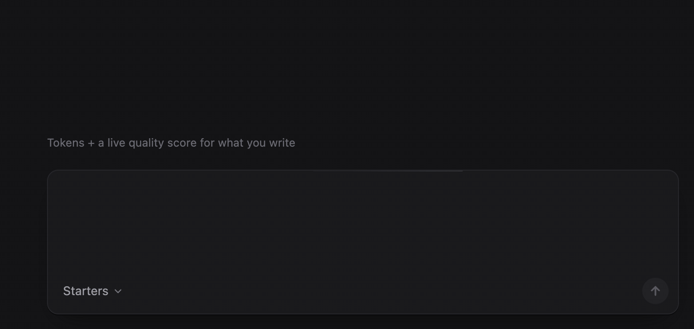
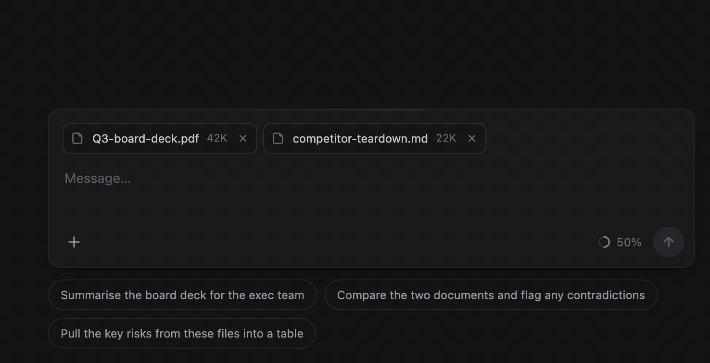
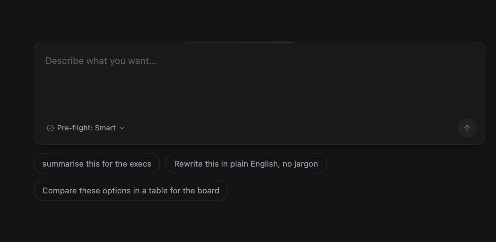
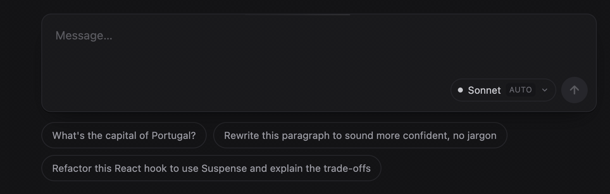

# Chat input concepts

Four concepts for the box you type into when you talk to a model. Each one
gives the person a piece of control or transparency that the usual empty field
hides. Switch between them at the top of the page, or compare all four at once.

| Concept | The idea |
|---|---|
| Prompt quality | A live score as you write, from six weighted dimensions: a scoped ask, concrete specs, an output shape, audience, guardrails and examples, with penalties for filler and hedging. Starter prompts with fill-in slots. |
| Context budget | The context window as a budget you spend. One quiet percentage pill at rest. The breakdown of what fills it, and how to free space, sits behind a click. |
| Intent mirror | A 200 ms pre-flight that restates what was heard. Solid chips for what you said, dashed chips for what it assumed, and any assumption swaps inline. One line says what the biggest assumption will do to the output. |
| Model router | A classifier reads the shape of the ask and picks a tier. The model pill is the router: it re-routes as you type, shakes once when it swaps, and can be pinned. |

The stance across all four: nudge, don't gate. Every state ships a next action.

Everything runs on local heuristics and canned samples. Nothing calls a model.
The point is the interaction, not the classifier.

## See them work

### Prompt quality

A vague ask scores 15%. The breakdown points at the missing output format, and
adding it takes the score to 75%.



### Context budget

The quiet pill opens onto what fills the window. Trimming the conversation
frees 31K tokens and the pill drops from 50% to 34%.



### Intent mirror

"Summarise this" with nothing attached triggers the pre-flight. What you said
is solid, what it assumed is dashed, and an assumption swaps in place.



### Model router

A lookup routes to Haiku. A refactor that asks for trade-offs re-routes to
Opus as you type.



## Run it

```
pnpm install
pnpm dev        # http://localhost:5180
```

## Stack

Vite 7, React 19, TypeScript, Tailwind 4, Framer Motion.

- `src/App.tsx` the concept switcher and the compare-all grid
- `src/ChatInput.tsx`, `src/ContextBudget.tsx`, `src/IntentMirror.tsx`, `src/ModelRouter.tsx` one file per concept
- `src/PromptQualityExploration.tsx` the earlier standalone study the prompt-quality concept grew from
